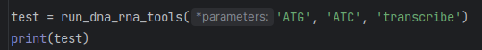
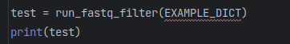
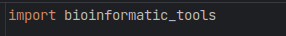
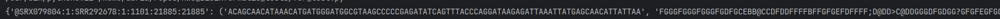

# HW 5. Moduls
> *This is the repo for the fifth homework of the BI Python 2023 course*

### bioinformatic_tools.py
`bioinformatic_tools.py` is a special tools kit for juniors bioinformatics 

***

### Overview
`bioinformatic_tools.py` includes functions to treatment of nucleic acids, 
polyaminoacid sequences and fastq files.
`bioinformatic_tools.py` can be used for the next goals:
- recoding 1-letter coded polyaminoacid seqeunces into 3-letter coded and *vice versa*;
- finding possinle RNA sequences for given polyaminoacid sequences;
- determining polyaminoacid isoelectric point;
- calculating polyaminoacid molecular weight;
- finding possible DNA sequences for given polyaminoacid sequences; 
- determining GC-content of a corresponding DNA sequence to a given polyaminoacid sequence;
- filter fastq files according next parameters: gc_content, length of sequence 
and phread score meaning;
- create transcribed sequences from DNA;
- create reversed sequences;
- create a complement sequences for given nucleic acids sequences;
- create a complement reversed sequences for given nucleic acids sequences;

### Usage
This tool can be used both standalone and as module.
- to use `bioinformatic_tools.py` standalone for treatment of RNA or DNA sequences, 
use the next syntax:

- to use `bioinformatic_tools.py` standalone for treatment of proteins, 
use the next syntax:

- to use `bioinformatic_tools.py` standalone for treatment of proteins, 
use the next syntax:

- to use `bioinformatic_tools.py` as a modul, import it in your script:


### Options
Arguments:
You can pass several arguments into all functions.
```*parameteres[str]``` - RNA or DNA sequences for ```run_dna_rna_tools```,
the last argument should be an operation:
```python
run_dna_rna_tools('ATG', 'transcribe') # 'AUG'
```
- `*args[str]` - protein sequences for ```run_prototools```, ```method``` - a method to use
```python
run_prototools('ValArg', method='get_protein_mrnas')
```
`seqs`, `gc_bounds`, `length_bounds`, `quality_threshold` - arguments for ```run_fastq_filter```, where
`seqs` is a dictionary with names of `fastq.files` as keys and values are `Tuple(seqs, phread_score)`
`gc_bounds` is an interval of GC-content for filtering, default meaning = `Tuple`(0, 100);
`length_bounds` is an interval of length of sequences in fastq files, default meaning = (0, 2**32));
`quality_threshold` - phread score meaning for filtering in `ASCII` code, default meaning = 0.
```python
run_fastq_filter(EXAMPLE_DICT, gc_bounds = (0, 20), length_bounds = (0, 2**32),
                 quaquality_threshold = 0)
```
output:
```run_dna_rna_tools``` returns `list[str] | str` ;

```run_prototools``` returns `dict`, where keys are your polyaminoacid sequences
and values are results of treatment;

```run_run_fastq_filter``` returns `dict`, where keys are names of fastq files 
and values are 'Tuple' of sequences and quality of each nucleotide


***

### Examples
```python
run_dna_rna_tools('ATG', 'transcribe') # 'AUG'
run_dna_rna_tools('ATG', 'reverse') # 'GTA'
run_dna_rna_tools('AtG', 'complement') # 'TaC'
run_dna_rna_tools('ATg', 'reverse_complement') # 'cAT'
run_dna_rna_tools('ATG', 'aT', 'reverse') # ['GTA', 'Ta']
```
def recode allows to translate 1-letter to 3-letters polyaminoacids code
- `main('AlaValTyr', 'DNT', method = 'recode')`
- `recode('AlaValTyr', 'DNT')`
- 
def from_proteins_seqs_to_rna allows to decode polyaminoacid sequences in RNA sequences
- `main('AlaValTyr', 'DNT', method = 'from_proteins_seqs_to_rna')`
- `from_proteins_seqs_to_rna('AlaValTyr', 'DNT')`
- 

def isoelectric_point_determination allows to determine isoelectric point of polyaminoacid sequences 
- `main('AlaValTyr', 'DNT', method = 'isoelectric_point_determination')`
- `isoelectric_point_determination('AlaValTyr', 'DNT')`
- 

def back_transcribe allows to decode polyaminoacid sequences in DNA sequences
- `main('AlaValTyr', 'DNT', method = 'back_transcribe')`
- `back_transcribe('AlaValTyr', 'DNT')`
- 

def count_gc_content allows to count the ratio of GC in the entire DNA sequence
- `main('AlaValTyr', 'DNT', method = 'count_gc_content')`
- `count_gc_content('AlaValTyr', 'DNT')`
- 

def count_protein_molecular_weight allows to calculate the molecular weight of the polyaminoacid
- `main('AlaValTyr', 'DNT', method = 'count_protein_molecular_weight')`
- `count_protein_molecular_weight('AlaValTyr', 'DNT')`
- 

def run_fastq_filter filter your fastq files according to parameters:
- `main(fastq, gc_bounds = (0, 20), length_bounds = (0, 2**32),
                 quaquality_threshold = 0`
- 
### Troubleshooting
If you have `ValueError("No input defined.")` it means, that you have an empty input. Please, enter the correct input. 

If you have `ValueError(method, " is not a valid method.")` it means, that your tool is not correct. Please, enter the right tool.

If you have `ValueError('Non-protein aminoacids in sequence')` it means, that your sequences contain non-protein aminoacids. Please, check your sequences and enter the correct input.

If you have `ValueError('Parameters are None')` it means, that your sequences are None. Please, check your sequences and enter the correct input.

If you have `ValueError('Given parameter was None')` it means, that you enter parameters as None. Please, check your sequences and enter the correct input.

If you have `ValueError('RNA sequence cannot contain T')` it means, that your sequences contain T in RNA. Please, check your sequences and enter the correct input.

If you have `ValueError('DNA sequence cannot contain U')` it means, that your DNA sequences contain U. Please, check your sequences and enter the correct input.

If you have `ValueError('Unknown tool')` it means, that you enter wrong tool. Please, check your sequences and enter the correct input.

If you have `ValueError('Your fastq_files are None')` it means, that your fastq file is None. Please, check your sequences and enter the correct input.

If you have `ValueError('Your fastq_files are empty')` it means, that your fastq file is empty. Please, check your sequences and enter the correct input.
***

### Contributions and contacts
Feel free to report any bugs and problems encountered.
in `bioinformatic_tools.py` :
nekrasovadasha22@mail.ru developed from_proteins_seqs_to_rna(), isoelectric_point_determination(), run_dna_rna_tools, run_fastq_filter
***
Email: nikita.sapozhnikov1@gmail.com developed recode(), prettify_alignment(), local_alignmen(), check_input()
*** 
alina.potyseva@gmail.com developed back_transcribe(), count_gc_content(), count_protein_molecular_weight()

***

### References

[^1]: T.F. Smith, M.S. Waterman, (1981). [Identification of common molecular subsequences](https://doi.org/10.1016/0022-2836(81)90087-5). Journal of Molecular Biology.